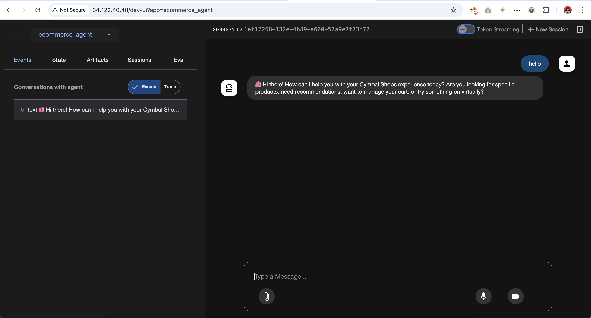

```mermaid
graph TB
    ProductFinder[🔍 Product Finder Agent] --> SearchTool[🔎 search_products]
    ProductFinder --> DetailTool[📋 get_product_details]

    SearchTool --> BeautifulSoup[🍲 BeautifulSoup4<br/>HTML Parsing]
    SearchTool --> Requests[📡 Requests<br/>HTTP Client]
    SearchTool --> CymbalShops[🏪 Cymbal Shops Website]

    DetailTool --> BeautifulSoup
    DetailTool --> Requests
    DetailTool --> CymbalShops

    ProductFinder --> MCP[🔌 MCP Integration]

    classDef agentClass fill:#e1f5fe,stroke:#01579b,stroke-width:2px
    classDef toolClass fill:#f3e5f5,stroke:#4a148c,stroke-width:1px
    classDef techClass fill:#e8f5e8,stroke:#1b5e20,stroke-width:1px
    classDef externalClass fill:#fff3e0,stroke:#e65100,stroke-width:2px

    class ProductFinder agentClass
    class SearchTool,DetailTool toolClass
    class BeautifulSoup,Requests,MCP techClass
    class CymbalShops externalClass
```

```mermaid
graph TB
    ProductRec[💡 Product Recommendation Agent] --> AllProductsTool[📦 get_all_products]
    ProductRec --> RecommendTool[🎯 recommend_products]
    ProductRec --> CategoryTool[🏷️ get_product_category]

    AllProductsTool --> BeautifulSoup[🍲 BeautifulSoup4<br/>HTML Parsing]
    AllProductsTool --> Requests[📡 Requests<br/>HTTP Client]
    AllProductsTool --> CymbalShops[🏪 Cymbal Shops Website]

    RecommendTool --> MLFiltering[🤖 ML-based Filtering<br/>Algorithm]
    RecommendTool --> ProductData[📊 Product Data<br/>Cached Results]

    CategoryTool --> Classification[🏷️ Classification<br/>Logic]

    classDef agentClass fill:#e1f5fe,stroke:#01579b,stroke-width:2px
    classDef toolClass fill:#f3e5f5,stroke:#4a148c,stroke-width:1px
    classDef techClass fill:#e8f5e8,stroke:#1b5e20,stroke-width:1px
    classDef externalClass fill:#fff3e0,stroke:#e65100,stroke-width:2px

    class ProductRec agentClass
    class AllProductsTool,RecommendTool,CategoryTool toolClass
    class BeautifulSoup,Requests,MLFiltering,ProductData,Classification techClass
    class CymbalShops externalClass
```

```mermaid
graph TB
    OrderAgent[🛒 Order Placement Agent] --> CartAddTool[➕ add_to_cart]
    OrderAgent --> CartRemoveTool[➖ remove_from_cart]
    OrderAgent --> CartViewTool[👁️ view_cart]
    OrderAgent --> CheckoutTool[💳 simulate_checkout]

    CartAddTool --> SessionStorage[🔐 Session Storage<br/>InMemorySessionService]
    CartRemoveTool --> SessionStorage
    CartViewTool --> SessionStorage
    CheckoutTool --> SessionStorage

    CheckoutTool --> OrderProcessing[📋 Order Processing<br/>Logic]
    CheckoutTool --> PaymentSim[💳 Payment Simulation<br/>Mock Gateway]

    classDef agentClass fill:#e1f5fe,stroke:#01579b,stroke-width:2px
    classDef toolClass fill:#f3e5f5,stroke:#4a148c,stroke-width:1px
    classDef techClass fill:#e8f5e8,stroke:#1b5e20,stroke-width:1px

    class OrderAgent agentClass
    class CartAddTool,CartRemoveTool,CartViewTool,CheckoutTool toolClass
    class SessionStorage,OrderProcessing,PaymentSim techClass
```

```mermaid
graph TB
    VirtualTryon[✨ Virtual Try-On Agent] --> ProcessImageTool[📸 process_user_image]
    VirtualTryon --> GenerateTryonTool[🎨 generate_tryon_image]
    VirtualTryon --> StyleRecTool[👔 get_style_recommendations]
    VirtualTryon --> SaveResultTool[💾 save_tryon_result]
    VirtualTryon --> DisplayTool[🖼️ display_tryon_result]

    ProcessImageTool --> Pillow[🖼️ Pillow PIL<br/>Image Processing]
    ProcessImageTool --> ImageValidation[✅ Image Validation<br/>Logic]

    GenerateTryonTool --> GeminiVision[🤖 Gemini 2.5 Flash<br/>Image Preview]
    GenerateTryonTool --> NanoBanano[🍌 Nano Banano API<br/>Virtual Try-On Service]

    StyleRecTool --> StyleAnalysis[👗 Style Analysis<br/>Algorithm]

    SaveResultTool --> ArtifactService[📁 Artifact Service<br/>InMemoryArtifactService]
    DisplayTool --> ArtifactService

    classDef agentClass fill:#e1f5fe,stroke:#01579b,stroke-width:2px
    classDef toolClass fill:#f3e5f5,stroke:#4a148c,stroke-width:1px
    classDef techClass fill:#e8f5e8,stroke:#1b5e20,stroke-width:1px
    classDef externalClass fill:#fff3e0,stroke:#e65100,stroke-width:2px

    class VirtualTryon agentClass
    class ProcessImageTool,GenerateTryonTool,StyleRecTool,SaveResultTool,DisplayTool toolClass
    class Pillow,ImageValidation,StyleAnalysis,ArtifactService techClass
    class GeminiVision,NanoBanano externalClass
```

# Cymbal Shops E-commerce Agents

An AI-powered e-commerce assistant system built for the GKE Turns 10 Hackathon. This project enhances the Cymbal Shops online boutique with intelligent agent capabilities using Google's Agent Development Kit (ADK).

## 🏗️ Architecture

The system consists of five specialized agents orchestrated by a main coordinator:


## 🔧 Agent Details

Each agent has specialized tools and dependencies for their specific functions:

### 🔍 Product Finder Agent


### 💡 Product Recommendation Agent


### 🛒 Order Placement Agent


### ✨ Virtual Try-On Agent


### 📄 Export Data Agent


```mermaid
graph TB
    ExportAgent[📄 Export Data Agent] --> ExportPDFTool[📋 export_order_to_pdf]
    ExportAgent --> GeneratePDFTool[📄 generate_order_pdf]
    ExportAgent --> ValidateDataTool[✅ validate_order_data]
    ExportAgent --> GetOrderTool[📊 get_order_from_placement_agent]
    ExportAgent --> SystemReqTool[🔧 get_system_requirements]

    ExportPDFTool --> ReportLab[📊 ReportLab<br/>PDF Generation]
    ExportPDFTool --> Base64[🔐 Base64<br/>Encoding]
    ExportPDFTool --> ArtifactService[📁 Artifact Service<br/>InMemoryArtifactService]

    GeneratePDFTool --> ReportLab
    GeneratePDFTool --> IOBuffer[💾 IO Buffer<br/>Memory Management]

    ValidateDataTool --> DataValidation[✅ Data Validation<br/>Logic]

    GetOrderTool --> OrderPlacementAgent[🛒 Order Placement Agent<br/>Internal API]

    SystemReqTool --> DependencyCheck[🔍 Dependency Check<br/>System Validation]

    classDef agentClass fill:#e1f5fe,stroke:#01579b,stroke-width:2px
    classDef toolClass fill:#f3e5f5,stroke:#4a148c,stroke-width:1px
    classDef techClass fill:#e8f5e8,stroke:#1b5e20,stroke-width:1px
    classDef externalClass fill:#fff3e0,stroke:#e65100,stroke-width:2px

    class ExportAgent agentClass
    class ExportPDFTool,GeneratePDFTool,ValidateDataTool,GetOrderTool,SystemReqTool toolClass
    class ReportLab,Base64,IOBuffer,DataValidation,DependencyCheck,ArtifactService techClass
    class OrderPlacementAgent externalClass
```

### Architecture Overview

The system follows a **hierarchical agent architecture** with specialized agents for different e-commerce functions:

### 🔍 Product Finder Agent
- **Purpose**: Search and discover products on the Cymbal Shops website
- **Features**:
  - Real-time product search using web scraping
  - Product detail retrieval with pricing and descriptions
  - MCP integration for external data sources
- **Tools**: `search_products()`, `get_product_details()`

### 💡 Product Recommendation Agent
- **Purpose**: Provide personalized product recommendations
- **Features**:
  - Category-based recommendations
  - Complementary product suggestions
  - Popular item recommendations
  - Style and preference-based filtering
- **Tools**: `get_all_products()`, `recommend_products()`

### 🛒 Order Placement Agent
- **Purpose**: Manage shopping cart and order processing
- **Features**:
  - Add/remove items from cart
  - Cart summary and total calculation
  - Simulated checkout process
  - Order confirmation and tracking
- **Tools**: `add_to_cart()`, `remove_from_cart()`, `view_cart()`, `simulate_checkout()`

### ✨ Virtual Try-On Agent
- **Purpose**: Enable virtual product try-on using AI image generation
- **Features**:
  - Image processing and validation
  - AI-powered virtual try-on (integration ready for nano banano API)
  - Style recommendations
  - Product suitability assessment
- **Tools**: `process_user_image()`, `generate_tryon_image()`, `get_style_recommendations()`

### 📄 Export Data Agent
- **Purpose**: Export order data and generate professional PDF documents
- **Features**:
  - Order confirmation PDF generation
  - Product details with pricing and quantities
  - Shipping and payment information
  - Professional formatting with tables and styling
  - Artifact storage for download
- **Tools**: `export_order_to_pdf()`, `validate_order_data()`, `get_order_from_placement_agent()`

## 🛠️ Technical Details

### Technologies Used
- **Google ADK 1.0.0**: Agent orchestration framework
- **FastAPI**: Web framework
- **BeautifulSoup4**: Web scraping
- **Pillow**: Image processing
- **MCP**: Model Context Protocol integration

### Data Sources
- **Primary**: Cymbal Shops website (https://cymbal-shops.retail.cymbal.dev/)
- **Product Data**: Real-time scraping from the live demo site
- **Cart Storage**: In-memory (production would use database)

### AI Models
- **LLM**: Gemini 2.0 Flash for agent reasoning and orchestration
- **Image Generation**: Gemini 2.5 Flash Image Preview for virtual try-on

## 🚀 Deployment

### Local Development
```bash
python3 -m venv venv
source venv/bin/activate

cp ecommerce_agent/.env.example ecommerce_agent/.env

## Update the ecommerce_agent/.env with API keys

pip install -r ecommerce_agent/requirements.txt
adk web ecommerce_agent

## Open url: http://127.0.0.1:8000
```

### Production (GKE)

1. Create a kubernetes Cluster from GCP: https://console.cloud.google.com/projectselector2/kubernetes/list/overview?supportedpurview=project&authuser=1

##### Creating cluster 


##### Cluster created


*NOTE: kubernetes Cluster creation could take 5-15 minutes*

We can also validate by running this command: `gcloud container clusters list --project=gke-agent`

2. Install `gcloud` & `kubectl` command line tools in your system
3. Authenticate gcloud cli: `gcloud auth login`
4. Set Product ID: `gcloud config set project [YOUR_PROJECT_ID]`
5. Enabled Google Cloud APIs:

```
Make sure the following APIs are enabled in your Google Cloud project:

Kubernetes Engine API (container.googleapis.com)
Cloud Build API (cloudbuild.googleapis.com)
Container Registry API (containerregistry.googleapis.com)
```

6. **Required IAM Permissions**: The user or Compute Engine default service account running the command needs, at a minimum, the following roles:

  - **Kubernetes Engine Developer** (`roles/container.developer`): To interact with the GKE cluster.

  - **Storage Object Viewer** (`roles/storage.objectViewer`): To allow Cloud Build to download the source code from the Cloud Storage bucket where gcloud builds submit uploads it.

  - **Artifact Registry Create on Push Writer** (`roles/artifactregistry.createOnPushWriter`): To allow Cloud Build to push the built container image to Artifact Registry. This role also permits the on-the-fly creation of the special gcr.io repository within Artifact Registry if needed on the first push.

  - **Logs Writer** (`roles/logging.logWriter`): To allow Cloud Build to write build logs to Cloud Logging.

7. Automated Deployment using `adk deploy gke`: This cli command will `automatically build images`, `write Kubernetes manifests` & push to `Artifact Registry`

  - Command: `adk deploy gke --project gke-agent --cluster_name gke-cluster --region us-central1 --with_ui --log_level info ecommerce_agent`


*NOTE: Wait for the adk deployment on gke, it could take 5-15 minutes*

8. Check POD Status: `kubectl get pods`


If `STATUS` is not running and failed, then need to check logs and fix the code or anyother permission issue

9. Find the External IP: Get the public IP address for your agent's service

```
kubectl get service
```


10. Visit the deployed service using external IP


 

## 📊 Performance

### Agent Response Times
- **Product Search**: ~1-2 seconds
- **Recommendations**: ~1-3 seconds
- **Cart Operations**: ~0.5 seconds
- **Virtual Try-On**: ~2-5 seconds
- **PDF Export**: ~1-2 seconds

## 📋 Sample Outputs

### Export Data Agent
The Export Data Agent generates professional PDF documents for order confirmations. A sample output is available:

📄 **[Sample Order PDF](./sample_exported_order_pdf.pdf)** - Demonstrates the PDF export functionality with:
- Order confirmation details and tracking information
- Complete product listings with prices and quantities
- Shipping address and payment method information
- Professional formatting with tables and branding
- Total cost calculations and order summary

## 📜 License

Built for educational and hackathon purposes. See the original Cymbal Shops license for base application terms.

---

*Built with ❤️ for the GKE Hackathon 2025*