# Cymbal Shops E-commerce Agents

An AI-powered e-commerce assistant system built for the GKE Turns 10 Hackathon. This project enhances the Cymbal Shops online boutique with intelligent agent capabilities using Google's Agent Development Kit (ADK).

## 🏗️ Architecture

The system consists of four specialized agents orchestrated by a main coordinator:

```mermaid
graph TB
    %% User Interface Layer
    User[👤 User] --> UI[🖥️ ADK Web Interface]
    UI --> Runner[🚀 ADK Runner]

    %% Main Coordinator
    Runner --> RootAgent[🏪 Ecommerce Root Agent<br/>Gemini 2.0 Flash]

    %% Agent Orchestration
    RootAgent --> |Product Search| ProductFinder[🔍 Product Finder Agent<br/>Gemini 2.0 Flash]
    RootAgent --> |Recommendations & Browse| ProductRec[💡 Product Recommendation Agent<br/>Gemini 2.0 Flash]
    RootAgent --> |Cart & Orders| OrderAgent[🛒 Order Placement Agent<br/>Gemini 2.0 Flash]
    RootAgent --> |Virtual Try-On| VirtualTryon[✨ Virtual Try-On Agent<br/>Gemini 2.0 Flash]

    %% Product Finder Tools
    ProductFinder --> SearchTool[🔎 search_products<br/>Web Scraping]
    ProductFinder --> DetailTool[📋 get_product_details<br/>Web Scraping]

    %% Product Recommendation Tools
    ProductRec --> AllProductsTool[📦 get_all_products<br/>Web Scraping]
    ProductRec --> RecommendTool[🎯 recommend_products<br/>ML-based Filtering]
    ProductRec --> CategoryTool[🏷️ get_product_category<br/>Classification]

    %% Order Placement Tools
    OrderAgent --> CartAddTool[➕ add_to_cart<br/>Session Storage]
    OrderAgent --> CartRemoveTool[➖ remove_from_cart<br/>Session Storage]
    OrderAgent --> CartViewTool[👁️ view_cart<br/>Session Storage]
    OrderAgent --> CheckoutTool[💳 simulate_checkout<br/>Order Processing]

    %% Virtual Try-On Tools
    VirtualTryon --> ProcessImageTool[📸 process_user_image<br/>Image Validation]
    VirtualTryon --> GenerateTryonTool[🎨 generate_tryon_image<br/>AI Image Generation]
    VirtualTryon --> ProductDetailsTool[📄 get_product_details_for_tryon<br/>Web Scraping]
    VirtualTryon --> SaveResultTool[💾 save_tryon_result<br/>Artifact Storage]
    VirtualTryon --> StyleRecTool[👔 get_style_recommendations<br/>Style Analysis]
    VirtualTryon --> DisplayTool[🖼️ display_tryon_result<br/>Artifact Loading]

    %% External Services & APIs
    SearchTool --> CymbalShops[🏪 Cymbal Shops Website<br/>cymbal-shops.retail.cymbal.dev]
    DetailTool --> CymbalShops
    AllProductsTool --> CymbalShops
    ProductDetailsTool --> CymbalShops

    %% AI & Image Services
    GenerateTryonTool --> GeminiVision[🤖 Gemini 2.5 Flash Image Preview<br/>AI Image Generation]
    GenerateTryonTool --> NanoBanano[🍌 Nano Banano API<br/>Virtual Try-On Service]

    %% Data Storage & Services
    Runner --> ArtifactService[📁 Artifact Service<br/>InMemoryArtifactService]
    Runner --> SessionService[🔐 Session Service<br/>InMemorySessionService]

    ArtifactService --> |Store/Load Images| VirtualTryon
    SessionService --> |User Sessions| OrderAgent

    %% MCP Integration
    ProductFinder --> MCP[🔌 MCP Integration<br/>Model Context Protocol]
    MCP --> ExternalData[🌐 External Data Sources]

    %% Tool Context
    ProductFinder --> ToolContext[🛠️ Tool Context]
    ProductRec --> ToolContext
    OrderAgent --> ToolContext
    VirtualTryon --> ToolContext

    ToolContext --> ArtifactService
    ToolContext --> SessionService

    %% Styling
    classDef agentClass fill:#e1f5fe,stroke:#01579b,stroke-width:2px
    classDef toolClass fill:#f3e5f5,stroke:#4a148c,stroke-width:1px
    classDef serviceClass fill:#e8f5e8,stroke:#1b5e20,stroke-width:2px
    classDef externalClass fill:#fff3e0,stroke:#e65100,stroke-width:2px

    class RootAgent,ProductFinder,ProductRec,OrderAgent,VirtualTryon agentClass
    class SearchTool,DetailTool,AllProductsTool,RecommendTool,CategoryTool,CartAddTool,CartRemoveTool,CartViewTool,CheckoutTool,ProcessImageTool,GenerateTryonTool,ProductDetailsTool,SaveResultTool,StyleRecTool,DisplayTool toolClass
    class ArtifactService,SessionService,ToolContext,Runner,UI serviceClass
    class CymbalShops,GeminiVision,NanoBanano,MCP,ExternalData externalClass
```



### Architecture Overview

The system follows a **hierarchical agent architecture** with specialized agents for different e-commerce functions:

### 🔍 Product Finder Agent
- **Purpose**: Search and discover products on the Cymbal Shops website
- **Features**:
  - Real-time product search using web scraping
  - Product detail retrieval with pricing and descriptions
  - MCP integration for external data sources
- **Tools**: `search_products()`, `get_product_details()`

### 💡 Product Recommendation Agent
- **Purpose**: Provide personalized product recommendations
- **Features**:
  - Category-based recommendations
  - Complementary product suggestions
  - Popular item recommendations
  - Style and preference-based filtering
- **Tools**: `get_all_products()`, `recommend_products()`

### 🛒 Order Placement Agent
- **Purpose**: Manage shopping cart and order processing
- **Features**:
  - Add/remove items from cart
  - Cart summary and total calculation
  - Simulated checkout process
  - Order confirmation and tracking
- **Tools**: `add_to_cart()`, `remove_from_cart()`, `view_cart()`, `simulate_checkout()`

### ✨ Virtual Try-On Agent
- **Purpose**: Enable virtual product try-on using AI image generation
- **Features**:
  - Image processing and validation
  - AI-powered virtual try-on (integration ready for nano banano API)
  - Style recommendations
  - Product suitability assessment
- **Tools**: `process_user_image()`, `generate_tryon_image()`, `get_style_recommendations()`

## 🛠️ Technical Details

### Technologies Used
- **Google ADK 1.0.0**: Agent orchestration framework
- **FastAPI**: Web framework
- **BeautifulSoup4**: Web scraping
- **Pillow**: Image processing
- **MCP**: Model Context Protocol integration

### Data Sources
- **Primary**: Cymbal Shops website (https://cymbal-shops.retail.cymbal.dev/)
- **Product Data**: Real-time scraping from the live demo site
- **Cart Storage**: In-memory (production would use database)

### AI Models
- **LLM**: Gemini 2.0 Flash for agent reasoning and orchestration
- **Image Generation**: Gemini 2.5 Flash Image Preview for virtual try-on

## 🚀 Deployment

### Local Development
```bash
python3 -m venv venv
source venv/bin/activate

cp ecommerce_agent/.env.example ecommerce_agent/.env

## Update the ecommerce_agent/.env with API keys

pip install -r ecommerce_agent/requirements.txt
adk web ecommerce_agent

## Open url: http://127.0.0.1:8000
```

### Production (GKE)
1. Build Docker container
2. Deploy to Google Kubernetes Engine
3. Configure secrets and environment variables
4. Set up load balancing and scaling

## 📊 Performance

### Agent Response Times
- **Product Search**: ~1-2 seconds
- **Recommendations**: ~1-3 seconds
- **Cart Operations**: ~0.5 seconds
- **Virtual Try-On**: ~2-5 seconds

## 📜 License

Built for educational and hackathon purposes. See the original Cymbal Shops license for base application terms.

---

*Built with ❤️ for the GKE Hackathon 2025*